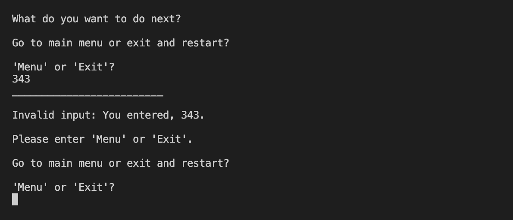

# Adventure Game

Welcome to my adventure game! This app was created solely with Python and deployed with Heroku. This game is designed to create an enjoyable, option-based, adventure and allow users to choose their own path to see if they can get the highest score! 

This game is geared towards all age groups and audiences. Whether you are looking for ideas to create your own adventure game or if you are just looking for a fun adventure, this app is for you!

## User Stories
- As a player, I want to be able to see clear rules for the game in order to know the objectives.
- As a player, I want to be able to create my character name at the beginning of the game, that will take me through the adventure.
- As a player, I want to be able to choose my beginning location for the adventure game, Mars or Earth.
- As a player, I want to have a story-driven experience that will take me to new places depending on my choices throughout the game.
- As a player, I want clear descriptions of surroundings and other characters to better immerse myself into the adventure.
- As a player, I want the game to have multiple possible outcomes based on my choices throughout the adventure.
- As a player, I want a clear way to be able to exit the game and restart the adventure.
- As a player, I want to be able to see my score tally, depending on my choices, and how many points I made compared to other players.

### Flowchart for story:

## Features

- The adventure begins with a welcome message and requests a name from the user to begin the game

- Once the user enters their name, a menu with options to navigate through the game appears

- Rules can be accessed from this menu to to explain the game so that the user is given all the information necessary
- From Rules, the user is able to go back to the Main Menu to choose the next option and start the game or exit and restart the game to enter a new username

- The user is given a choice to view the scoreboard before starting the game to see their competitors scores

- The story can be started from the main menu and jumps right into requesting an option from the user

- The game requests options of A or B throughout the adventure to provide consistent requests to the user

- The story output is delayed to give the user time to read all material and also delays each character of the words so that the text is typed out and offers better user experience and readability

- The terminal is cleared after each move to allow for better user experience and clear readability

- The game uses expressive and detailed language to allow the user to be immersed into the story

- When the user chooses the correct answer they are shown a message to explain they survived and gained a point towards their overall score

- The score is updated and can be seen in the terminal while the story plays out to allow the user to always know their current score

- When the user chooses the incorrect answer they are shown a message to explain the game is over and that they lost a point towards their overall score

- A scoreboard spreadsheet has been implemented to keep track of the users score. This was created with Google Sheets and connected with an API

- The scoreboard is automatically printed, in chart view, to the terminal when the users game is over to show them their results, compared to other players. Once the scoreboard is printed, the game offers the user the choice to go back to the menu and choose from the options again or exit and restart the game as a new player

- The user is given clear exceptions when input is invalid or empty and offers a resubmission of input (more examples in testing section)

- The input requests allow for upper and lowercase letters to provide a better user experience

- When input is requested, the user is able to type "exit" to restart the game at any chosen point and is taken to the very beginning to reenter a new username

## Testing

- Game begins and when prompted for a username, if the input is empty when entered, it requests a name from the user.

- When in the main menu, the user is asked to enter an option: A, B, or C. When the input is any value other than A, B, or C, OR when the input is empty, the user is prompted that the input is invalid and asks them to only enter A, B, or C. Lowercase letters are allowed for better user experience.

- If the customer navigates to rules, they are prompted to choose to either go back to the main menu or exit and restart the game. 

    - The exceptions catch if the input is incorrect:

    - The exceptions also catch if the input is empty:

- When the user chooses to see the scoreboard, they are then given the option to go back to the main menu or exit and restart the game, where the input catches exceptions

    - The exceptions catch if the input is empty:

    - The exceptions also catch if the input is invalid. These exceptions tell the user what was entered so they can see their mistake:

- When the user starts the game, the story asks for input of the users choice. The input request catches exceptions when the input is empty or invalid:

    - Empty input:

    - Invalid input:

    - These input requests will accept upper or lowercase letters

- When testing, I tried to break the code in every way possible by entering invalid data of letters, words, numbers, characters and empty input. No issues occurred and all exceptions where caught when testing manually

### Validator testing

- No errors were found when the code was run through  [CI Python Linter](https://pep8ci.herokuapp.com/)

### Bugs & Errors

- Commit #80f00d8 was meant to read as follows: "Add functions to story  when user chooses earth"
    - I accidentally pushed the commit without realizing my error of stating "mars" again so I researched on how to change a previous commit message. 
    - I used Slack and this [GitHub Doc](https://docs.github.com/en/pull-requests/committing-changes-to-your-project/creating-and-editing-commits/changing-a-commit-message) to try to amend the issue with "git rebase -i HEAD~n". This became increasingly confusing.
    - Tutor support was contacted and advised that -'Having an incorrect message is a much smaller problem than trying to change your commit.'- and everything should be working normally, but that Codeanywhere seemed to have a glitch as I wasn't able to save new updates and use the advised "git push --force" command. I was then told to create a new workspace and I was up and running again. 
    - I was not able to rename the commit message and was advised to add a note to my README file.
- While creating the exceptions throughout the story, depending on user input, I began using if/elif/else statements inside while True: loops. This was causing the 'else' statement to print indefinitely as the while loop did not have an end point.
    - I implemented try and except statements within my while loops so that the loop could be exited.
- When updating my rules_of_game function, the loop would not end and continually asked the user for input, even when the input seemed correct. This was because I was using .upper() and trying to get a 'Yes' or 'No' answer from the user. I ended up changing the function to implement a more user friendly approach and ensuring separation of concerns, so the 'Yes' and 'No' were no longer necessary. However, I did learn that .upper() will only check against uppercase input options, while .lower() will only check against lowercase input options. 

#### Notes

- While committing changes, I had multiple instances where CodeAnywhere was down and I was unable to push commits. This resulted in fewer commits.

## Modules imported

- 'time' was imported and used to delay feedback to the user and print each character one at a time, in order to provide a better user experience to read along with the story. This was implemented with guidance from my mentor.
- 'os' module was imported to access os.system and clear the terminal when needed.
- 'tabulate' module was imported and used to print the scoreboard as a table at the end of the users game.
- 'gspread' was imported to link the program with the Google Spreadsheet. Credentials were imported from google.oauth2.service_account to access the creds.json file.

## Deployment with Heroku

1. Ensure that each input has a new line (\n) at the end, as there is a glitch in the mock terminal created for this project.
2. Create a list of requirements so Heroku will install the list of dependencies. While in the requirements.txt file, this is done by typing 'pip3 freeze > requirements.txt' into the terminal.
3. Create an account and login with [Heroku](https://www.heroku.com).
4. Click "New" and then "Create New App" button.
5. Enter the apps name (in this case, I chose "morgan-adventure-game") and choose the region (in this case "Europe" as I reside in Ireland) and click the "Create App" button
6. Navigate into the "Settings" tab.
7. Go to "Config Vars" section and click "Reveal Config Vars"
8. Enter first config vars: 
    - "CREDS" into Key input and copy over all content from your creds.json file into the Value input section
9. Enter second config vars:
    - "PORT" into Key input and "8000" into the Value input
10. Scroll down to "Buildpacks" section and click on "Add Buildpack"
11. Add buildpacks by searching and selecting the correct buildpacks
    - First buildpack chosen should be PYTHON
    - Second buildpack chosend should be NODEJS
12. Navigate back to the top and into the "Deploy" tab.
13. Under "Deployment Method" click on "GitHub" 
14. Once connected to GitHub, search for your respository name (in this case "adventure-game") and click "Connect"
15. You can then choose to deploy your app with "Manual Deploy" or "Automatic Deploys"
    - Automatic deploys will deploy a new version of your app each time you 'push' to the specific branch in GitHub.
    - Manual deploy means your app will only deploy when you choose and click "Deploy Branch"
16. Once the build is complete, a link will be provided that you can click on to access a new window with your deployed app!

### Fork repository

- Forking a repository allows you to create a copy to GitHub, and any changes made will not affect the original repository:
    1. Within GitHub, navigate to the repository page you are going to fork
    2. Click "Fork" on the top right corner of the page
    3. Wait for the copy to be created and you are then redirected to the forked repository

### Clone repository

- Cloning a repository allows you to create a local copy of a repository on your machine:
    1. Within GitHub, navigate to the repository you are wanting to clone
    2. Click the green "<>Code" button
    3. Within the "Local" tab, copy the HTTPS url
    4. In your IDE, open Git Bash and type in 'git clone' followed by the pasted url just copied from GitHub. (git clone https://example.com/repository/project)
    5. The clone has been created on your local machine

## Credits

- The Love Sandwiches walkthrough "Getting Set Up" videos were used to import gspread and google.auth dependencies in order to access the Google Sheet API. The SCOPE was also used from Love Sandwiches.
- The overal concept of how to start an adventure game came from watching [this text-based adventure game YouTube video tutorial](https://www.youtube.com/watch?v=ORsJn-71__0)
- When implementing exception handling, the following resources were used for understanding:
    - [Exception & Error Handling in Python](https://www.datacamp.com/tutorial/exception-handling-python)
    - [Built-in Exceptions](https://docs.python.org/3/library/exceptions.html#Exception)
- Python styling guidance was from [How to Write Beautiful Python Code With PEP 8](https://realpython.com/python-pep8/)
- [Geeks for Geeks](https://www.geeksforgeeks.org/clear-screen-python/) was referenced to create the function to clear terminal for a better user experience.
- [How to set up a scoring system](https://www.youtube.com/watch?v=3IE2TMMeytU) was referenced when creating the scoring system for this game. I also contacted tutor support for additional assistance.
- The Love Sandwiches walkthrough videos were used to follow the deployment process through Heroku.

### Tools

- [GitHub](https://github.com) was used to store the code for this project
- [Heroku](https://www.heroku.com) was used to deploy the site
- [TinyPNG.com](https://tinypng.com/) was used to compress screenshots for this README.md file
- [PEP8 Validator](https://pep8ci.herokuapp.com/) was used to test the code
- [LucidChart](https://www.lucidchart.com/pages/) was used to create the flowchart and organize the story line for the adventure

### Acknowledgements

- I would like to thank CI Tutor Support for providing assistance when I was stuck with my project. They provided great guidance to allow me to find the solution myself.
- I would like to thank my mentor, Narender Singh, for all the guidance on this project and for fitting so much quality information into the fewer sessions I was able to schedule.
- I would like to thank the Slack community for their help and support through this project!